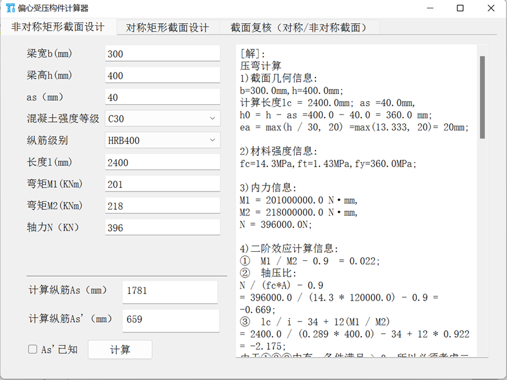
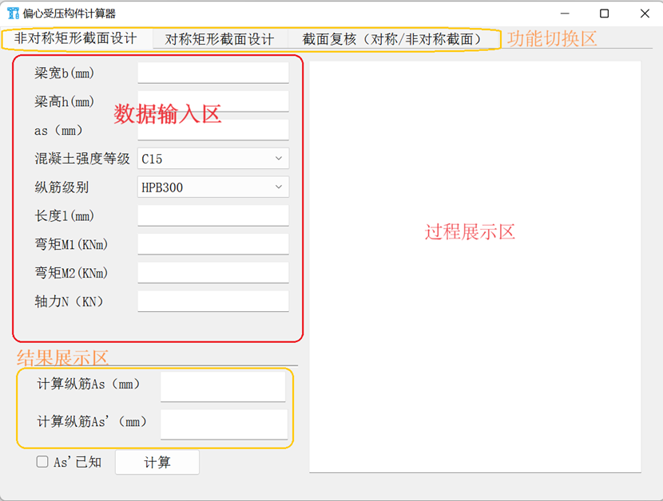

-   # 混凝土偏心受压构件计算器

    这是一个基于 Python、PyQt5 和 Pandas 开发的桌面应用程序，用于快速、准确地计算和校核钢筋混凝土偏心受压构件。

    本工具旨在解决土木工程专业在学习和实践中遇到的偏心受压构件计算问题——这类计算往往情况复杂、公式繁琐、手算耗时。通过将《混凝土结构设计原理》（李爱群版）及《混凝土结构基本原理》（顾祥林版）的复杂计算流程程序化，本软件实现了高效、自动化的截面设计与承载力校核。

    ## 核心功能

    本计算器包含三个核心功能模块，通过顶部的选项卡进行切换：

    1. **非对称配筋截面设计**:
       - 根据输入的截面尺寸、材料强度、荷载（轴力N、弯矩M1, M2）等参数，计算所需受拉钢筋 $A_s$ 和受压钢筋 $A_s'$ 的面积。
       - 支持 $A_s'$ **已知 / 未知** 两种工况（通过复选框动态切换输入框）。
       - 自动判断大、小偏心受压，并按规范考虑 P-δ 效应。
    2. **对称配筋截面设计**:
       - 在对称配筋（$A_s = A_s'$）的条件下，根据输入参数计算截面所需的总钢筋面积。
       - 简化了对称构件的设计流程。
    3. **截面承载力校核**:
       - 根据已知的截面参数和配筋情况，校核其承载能力。
       - 支持两种校核工况（通过复选框动态切换）：
         - **已知轴力** $N$ **求弯矩** $M$：计算构件能承受的最大弯矩设计值。
         - **已知偏心距** $e_0$ **求轴力** $N$：计算构件能承受的最大轴向力设计值。

    ## 功能展示

    

    

    ## 技术栈

    - **Python 3**
    - **PyQt5**: 用于构建图形用户界面 (GUI)。
    - **Pandas**: 用于读取和管理 `.csv` 格式的材料性能数据库。
    - **PyInstaller**: (用于打包) 将项目打包为单文件 `.exe` 可执行程序。

    ## 项目结构

    ```
    .
    ├── csv/                      # 材料参数数据文件目录
    │   ├── a1b1.csv            # α1, β1 (混凝土强度相关系数)
    │   ├── concrete.csv        # 混凝土强度等级 (fc, ft)
    │   ├── epsilon_b.csv       # 界限相对受压区高度 (ξb)
    │   ├── fai.csv             # 稳定系数 (φ)
    │   └── steelbar.csv        # 钢筋强度等级 (fy, fy')
    ├── img/                      # README 示例图片
    │   ├── example.png
    │   └── ui_showing.png
    ├── scr/ 
    │   ├── asymmetrical_rc_eccentric_compression.py  # 核心算法：非对称受压
    │   ├── compression_design.ui     # PyQt5 UI 定义文件 (使用Qt Designer创建)
    │   ├── getConstant.py            # 核心模块：材料参数获取 (使用pandas)
    │   ├── main.py                   # 主程序入口 (GUI逻辑与槽函数)
    │   ├── rc_check.py               # 核心算法：截面校核
    │   ├── symmetrical_rc_compression.py   # 核心算法：对称受压
    │   ├── requirements.txt          # Python 依赖包
    │   ├── main.spec                 # PyInstaller 打包配置文件
    │   ├── icon.png                  # 应用图标
    └── 偏心受压构件计算器.exe           # Windows可执行文件
    ```

    ## **安装与运行**

    本项目提供了两种运行方式：为普通用户提供的可执行文件，以及为开发人员提供的源代码运行环境。

    ### **1. 普通用户 (下载即用)**

    1. **下载**: 从 [GitHub Releases 页面](下载[偏心受压构件计算器.exe](https://github.com/BAIKEMARK/rc-eccentric-compression-calculator/blob/master/%E5%81%8F%E5%BF%83%E5%8F%97%E5%8E%8B%E6%9E%84%E4%BB%B6%E8%AE%A1%E7%AE%97%E5%99%A8.exe)，双击可执行文件即可使用) 下载最新的 `偏心受压构件计算器.exe` 文件。
    2. **运行**: 双击 `偏心受压构件计算器.exe` 可执行文件即可直接运行。

    ### **2. 开发人员 (从源码运行)**

    #### 准备环境

    建议使用 `conda` 或 `venv` 创建一个独立的 Python 虚拟环境。

    ```
    # (可选) 创建并激活 conda 虚拟环境
    conda create -n concrete_calc python=3.9
    conda activate concrete_calc
    ```

    #### 克隆项目

    ```
    git clone https://github.com/BAIKEMARK/rc-eccentric-compression-calculator.git
    cd rc-eccentric-compression-calculator
    ```

    #### 安装依赖

    项目所有依赖项均已在 `requirements.txt` 中列出。

    ```
    # 安装所有依赖
    pip install -r requirements.txt
    ```

    #### 运行程序

    执行 `main.py` 文件以启动应用程序。

    ```
    python main.py
    ```

    ## **打包为 .exe (可选)**

    本项目包含一个配置好 `main.spec` 文件，用于 `PyInstaller` 打包。该配置文件已正确设置了如何捆绑 `csv/` 目录下的数据文件和 `compression_design.ui` 界面文件。

    如果需要重新打包，请先安装 `pyinstaller`：

    ```
    pip install pyinstaller
    ```

    然后执行打包命令：

    ```
    pyinstaller main.spec
    ```

    打包完成后，可在 `dist/` 目录下找到 `偏心受压构件计算器.exe` 文件。

    ## 参考文献

    [1] 李爱群, 程文瀼, 王铁成. 混凝土结构·上册：混凝土结构设计原理（第7版）[M]. 北京:中国建筑工业出版社, 2020. 

    [2] 顾祥林. 混凝土结构基本原理[M].上海:同济大学出版社，2023.
